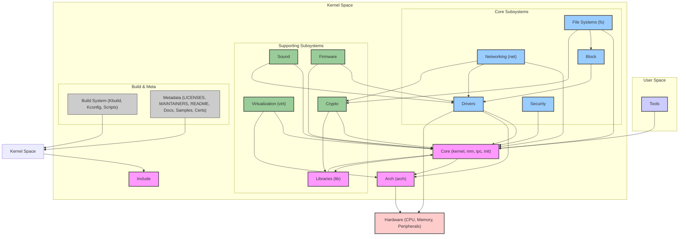

```mermaid
graph TD
    subgraph "User Space"
        Tools
    end

    subgraph "Kernel Space"
        Core["Core (kernel, mm, ipc, init)"]
        Arch["Arch (arch)"]

        subgraph "Core Subsystems"
            Drivers
            Net["Networking (net)"]
            FS["File Systems (fs)"]
            Block
            Security
        end

        subgraph "Supporting Subsystems"
            Virt["Virtualization (virt)"]
            Sound
            Crypto
            Firmware
            Lib["Libraries (lib)"]
        end

        Include

        subgraph "Build & Meta"
            BuildSystem["Build System (Kbuild, Kconfig, Scripts)"]
            Metadata["Metadata (LICENSES, MAINTAINERS, README, Docs, Samples, Certs)"]
        end
    end

    %% Core & Arch Interactions
    Core --> Arch
    Arch --> HW["Hardware (CPU, Memory, Peripherals)"]
    Core --> Lib
    KernelSpace["Kernel Space"] --> Include

    %% Core Subsystems Interactions
    Drivers --> Core
    Drivers --> Arch
    Drivers --> HW

    Net --> Core
    Net --> Drivers
    Net --> Crypto

    FS --> Core
    FS --> Block
    FS --> Crypto

    Block --> Drivers
    Security --> Core

    %% Supporting Subsystems Interactions
    Virt --> Core
    Virt --> Arch

    Sound --> Core
    Sound --> Drivers

    Crypto --> Core
    Crypto --> Lib

    Firmware --> Drivers
    Firmware --> Core

    Lib --> Core


    %% User Space and Build/Meta
    Tools --> Core
    BuildSystem --> KernelSpace
    Metadata --> KernelSpace


    %% Style
    classDef core fill:#f9f,stroke:#333,stroke-width:2px;
    classDef arch fill:#ff9,stroke:#333,stroke-width:2px;
    classDef core_subsystem fill:#9cf,stroke:#333,stroke-width:2px;
    classDef supporting_subsystem fill:#9c9,stroke:#333,stroke-width:2px;
    classDef buildmeta fill:#ccc,stroke:#333,stroke-width:1px;
    classDef hardware fill:#fcc,stroke:#333,stroke-width:2px;
    classDef userspace fill:#ccf,stroke:#333,stroke-width:2px;

    class Core,Arch,Lib,Include core;
    class Drivers,Net,FS,Block,Security core_subsystem;
    class Virt,Sound,Crypto,Firmware supporting_subsystem;
    class BuildSystem,Metadata buildmeta;
    class HW hardware;
    class Tools userspace;
```
